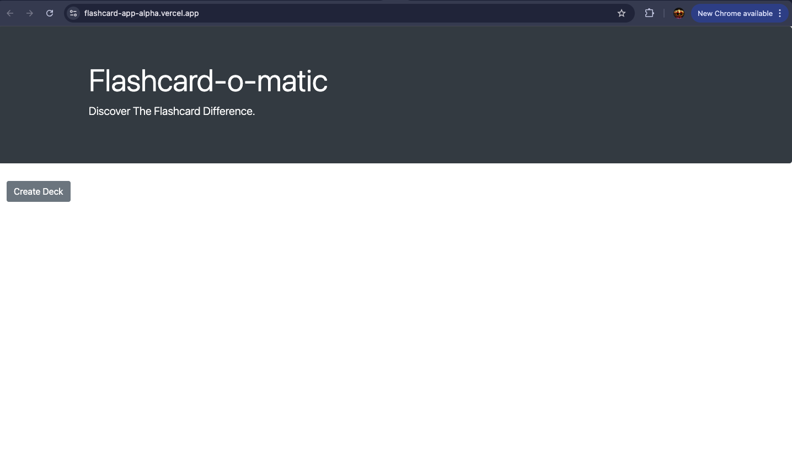
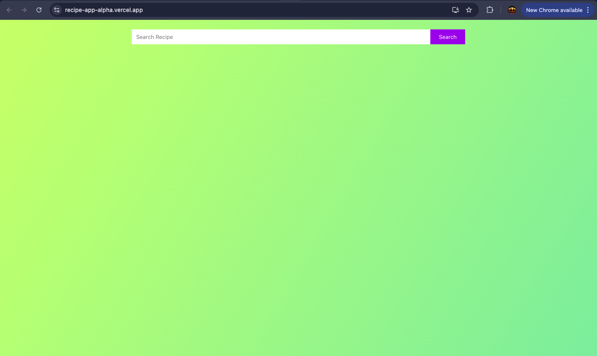
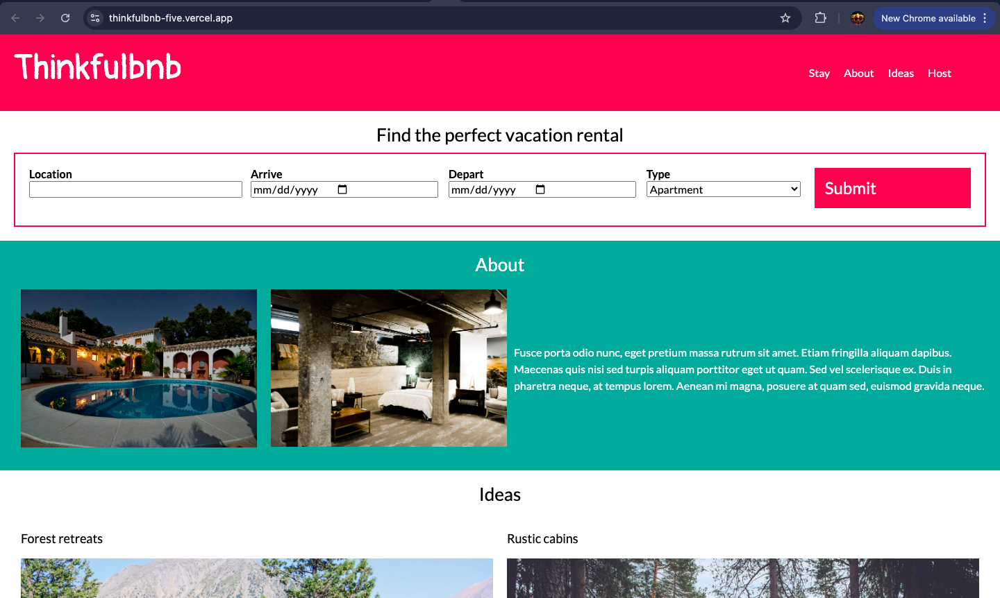

# Alpha Diallo Portfolio

A modern 3D developer portfolio built to showcase my growth, current technical skills, selected projects, and direction as a software engineer.

## Overview

This portfolio is being rebuilt with a cleaner structure, stronger visuals, improved responsiveness, and a more polished presentation. I decided to restart my portfolio because my skills have grown, and I want the site to reflect the level of work I am capable of building now.

The goal is to create a professional portfolio that feels modern, smooth, and easy to explore. This version focuses on better spacing, improved performance, stronger project presentation, responsive design, and a futuristic 3D visual style.

## Why I Am Rebuilding This Portfolio

My original portfolio helped me present my early work, but I have gained more experience since then. I now have a better understanding of React, Next.js, responsive layouts, UI polish, performance, animation, and how to communicate project value clearly.

This rebuild gives me a fresh foundation to:

- Improve the overall design and layout
- Add more detailed project information
- Showcase my current technical skills
- Present my coding journey more professionally
- Improve responsiveness across screen sizes
- Add better visuals and sample images
- Continue expanding the portfolio as I build more projects

## Sample Photos

These sample photos represent the type of project visuals used throughout the portfolio. They can be updated as the portfolio grows.







## Features

- 3D hero section with a custom astronaut model
- Space-themed animated background
- Smooth scroll reveal animations
- Responsive layout for mobile, tablet, laptop, desktop, and ultrawide screens
- Updated About Me and Coding Journey section
- Project cards with images, descriptions, technology tags, live links, and GitHub links
- Skills section with progress indicators
- Contact section with email and social links
- Modern dark theme with purple and blue visual accents
- Performance-focused rendering and lazy-loaded visual elements

## Tech Stack

- Next.js
- React
- TypeScript
- JavaScript
- Tailwind CSS
- Three.js
- React Three Fiber
- Drei
- Framer Motion
- Lucide React
- shadcn/ui
- Vercel

## Getting Started

### Prerequisites

Make sure you have Node.js installed. Node.js 18.18 or newer is recommended.

### Installation

Clone the repository:

```bash
git clone https://github.com/AlphaDiallo1/alpha-diallo-portfolio.git
cd alpha-diallo-portfolio
```

Install dependencies:

```bash
npm install
```

Run the development server:

```bash
npm run dev
```

Open the local development URL in your browser:

```bash
http://localhost:3000
```

## Available Scripts

```bash
npm run dev
```

Runs the app in development mode.

```bash
npm run build
```

Builds the app for production.

```bash
npm run start
```

Starts the production build.

```bash
npm run lint
```

Runs linting if configured.

## Project Structure

```text
app/
  globals.css
  layout.tsx
  page.tsx

components/
  animated-profile.tsx
  floating-element.tsx
  hero-model.tsx
  portfolio-visuals.tsx
  project-card.tsx
  scroll-3d-object.tsx
  scroll-reveal.tsx
  skill-badge.tsx
  ui/

hooks/
  use-mobile.tsx
  use-toast.ts

lib/
  utils.ts

public/
  images/
```

## Current Status

This portfolio is currently being restarted and improved. The rebuild includes layout polish, better responsiveness, updated 3D visuals, improved project presentation, and more detailed content.

More sections, images, projects, and refinements will be added as the portfolio continues to grow.

## Roadmap

- Add more detailed project case studies
- Improve project screenshots and sample images
- Add more polished 3D interactions
- Continue improving mobile responsiveness
- Add stronger accessibility details
- Refine copywriting for recruiters and collaborators
- Keep optimizing performance

## Author

Alpha Diallo

- GitHub: [AlphaDiallo1](https://github.com/AlphaDiallo1)
- LinkedIn: [Alpha Diallo](https://www.linkedin.com/in/alpha-diallo-a43b38217/)
- Email: [adiallo371@gmail.com](mailto:adiallo371@gmail.com)

## License

This project is for portfolio and learning purposes.
